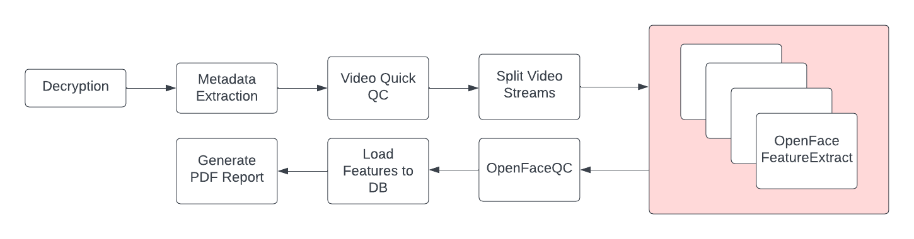

# AV Pipeline

This is an AV (Audio-Video) processing pipeline, used to generate QC Reports for the AV files. Designed to support Zoom recordings, the pipeline can be extended to support other AV files as well.

## Architecture

## Features

- [x] Supports decrytion of encrypted AV files
  - Uses `cryptease` to decrypt the encrypted AV files
- [x] Extracts Metadata from the AV files using `ffprobe`
- [x] Detects if videos have black-bars using `opencv`
- [x] Split Interviews into Left and Right Streams using `ffmpeg`
  - Assumes that the video has a 2 Column layout
  - Each column is a different speaker (Interviewer and Subject)
- [x] Extracts facial features using `OpenFace`
- [x] Generates a QC Report for the AV files
  - The QC Report includes the following:
    - Metadata
    - Facial Features
    - Openface Face in Frame
    - Openface Confidence

## Tech Stack

- Python
- OpenCV
- FFmpeg
- OpenFace
- Postgres (Database)
